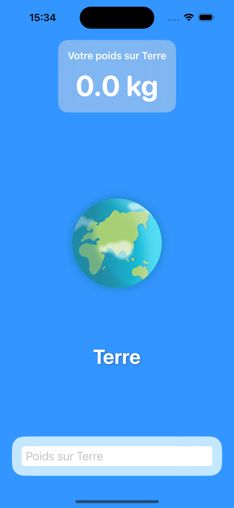
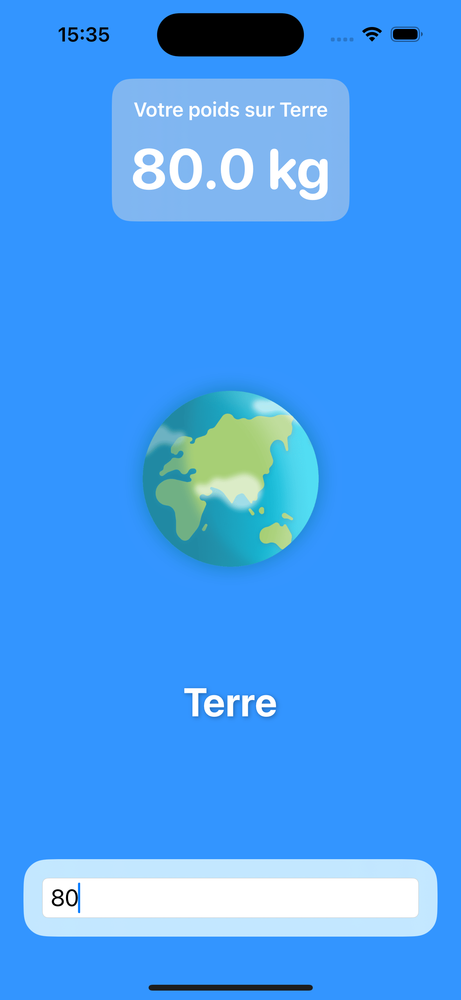
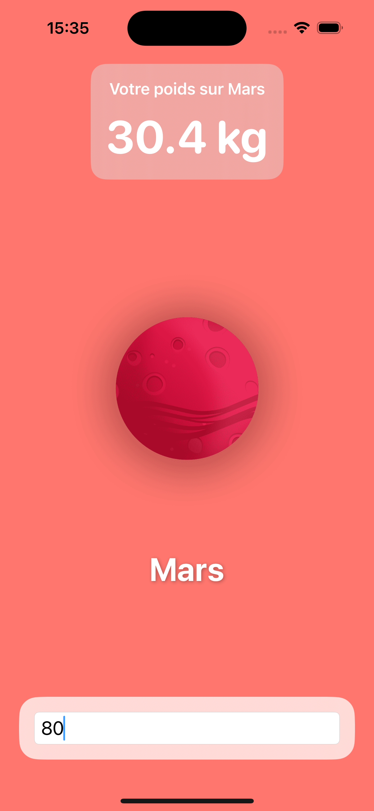
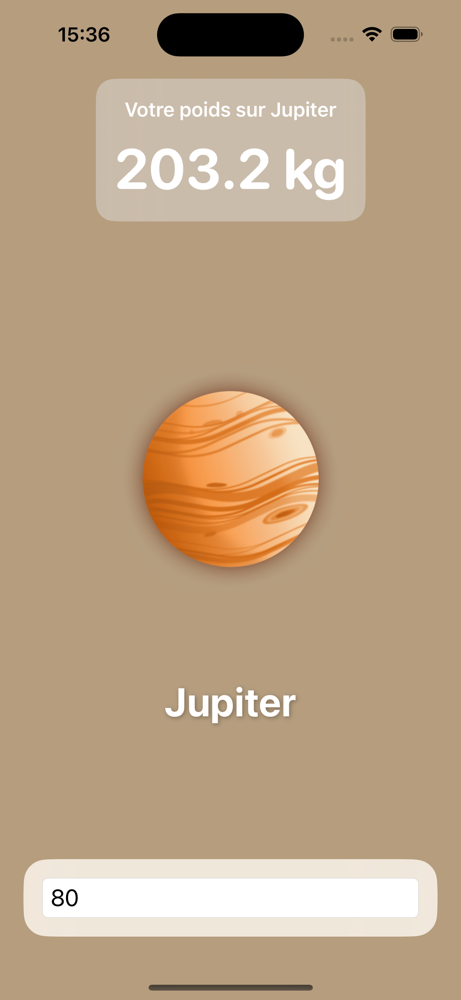

# 🌍 PlanetWeight

**PlanetWeight** est une application iOS simple, éducative et ludique qui permet de découvrir son poids sur les différentes planètes du système solaire.

Basée sur les gravités réelles des astres, l’application offre une expérience rapide et interactive pour visualiser comment la gravité influence ton poids selon l’endroit où tu te trouves dans l’univers.

---

## 🚀 Fonctionnalités

- 🪐 Calcul du poids sur Mercure, Vénus, Mars, Jupiter, Saturne, Uranus, Neptune et Pluton
- 🧮 Interface intuitive pour entrer son poids et obtenir les résultats instantanément
- 🎨 Design épuré avec SwiftUI
- 💡 Expérience éducative : idéale pour les curieux, étudiants ou fans d’astronomie

---

## 📸 Aperçu (à ajouter)

<p align="center">
   
   
   
   
</p>

---

## 🛠 Technologies

- Swift 5
- SwiftUI
- MVVM
- Xcode 15+
- Aucune dépendance externe

---

## ▶️ Installation

1. Clone ce repo :
   ```bash
   git clone https://github.com/DevTipsy/PlanetWeight.git
